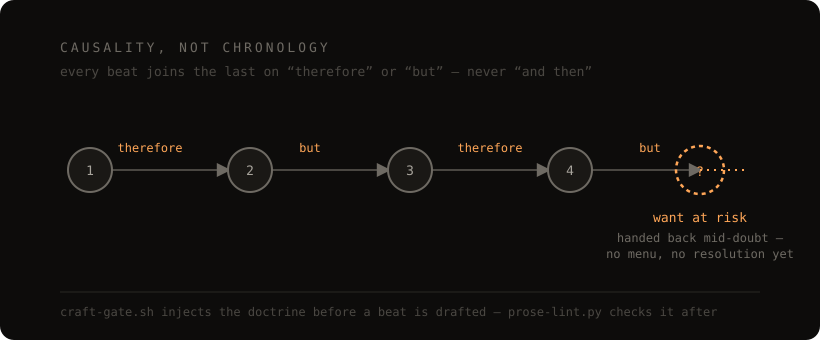

<div align="center">



<h1>story-loop</h1>

<p><b>Interactive fiction that reads like it was actually written, past the last chapter.</b><br>
Built for <a href="https://obsidian.md">Obsidian</a> + <a href="https://www.claude.com/claude-code">Claude Code</a>.<br>
Fifteen craft reports distilled into a standard the prose is held to — the hooks below exist to protect that standard, not to be the point.</p>

[](_craft_research/CRAFT_SPINE.md)
[](https://github.com/christian93kg/story-loop/generate)


</div>

---

## Why this exists

Most LLM-run interactive fiction reads the way you'd expect improvised fiction to read: competent, forgettable, and prone to sliding into slice-of-life filler once the premise runs dry. Feelings get named instead of shown, choices multiply without changing anything, and a story scoped for twelve chapters is still setting up its premise in chapter twenty. None of that is a model capability problem — a model that has read a huge amount of good fiction can write it too. It just needs the actual craft in front of it as a standard to write against, not as advice it read once in a system prompt and quietly drifted past.

So the product here is the writing, in this order:

|  | |
|:--:|---|
| **1** | **The craft.** Fifteen deep-research reports (`_craft_research/index.md`), distilled into one always-on spine (`CRAFT_SPINE.md`) and a mode-specific card shelf — literary technique (withheld emotion, causality over chronology, restraint under pressure) stated as falsifiable rules with before/after examples, not "write tense prose." |
| **2** | **The shape.** Before Chapter 1, a story has to name its ending and a realistic length — the discipline that keeps a story arriving somewhere instead of drifting until it's abandoned. |
| **3** | **What holds the line.** A hook injects the canon before a beat is drafted; a linter checks the draft after; a separate second reader catches what regex can't. None of this writes a word of fiction — it exists so point 1 survives to the last chapter instead of eroding by chapter ten, which is the part a chat window can't give you on its own. |

The proof isn't the mechanism in point 3. It's what that mechanism is protecting — here's the same beat, written once against the standard in point 1 and once without it.

---

## The prose this is built to produce

`CRAFT_SPINE.md` is eight through-lines, not eight suggestions. Same beat, same facts, written once against them and once without — this is the actual difference, not a claim about it:

**Without the spine:**

> You walk into the lab, which is cold and a little unsettling, and you wonder why Voss keeps it that way. The benches are old but well-maintained, with steel fittings that show someone cares about the equipment. You find your bench, which is the third one from the front on the left side, and then you notice that your lab partner has already set everything up for both of you, which is a thoughtful thing to do. You feel grateful and a little surprised that she would bother, and you wonder if you should say something about it.

**Against it** (`.claude/hooks/fixtures/ch3b3_good.md`, the kit's own lint fixture):

> The lab sits four degrees under the corridor and Voss never says why. The steel on the benches is polished. The floor underneath is not. Third from the front, left side, is yours.
>
> It's laid out when you get there. Both halves — scales trued, burner set, your mortar squared to the bench edge at the same distance as hers.
>
> [...]
>
> You look at your half of the bench. "Why?"
>
> "Because it was going to bother me." She doesn't say which part.
>
> [...four exchanges later, the beat hands back on:]
>
> "Are you going?"

Line by line, against the actual spine text:

| Without | Against | Through-line |
|---|---|---|
| "which is cold and a little unsettling" | "The steel on the benches is polished. The floor underneath is not." | **Perception over stated emotion** — report what the body notices, not what it feels |
| "old but well-maintained, with steel fittings that show someone cares" | "Third from the front, left side, is yours." | **One telling particular over catalogue** — a single load-bearing detail beats piled adjectives |
| "which is a thoughtful thing to do" | "She doesn't say which part." | **Narrator stays out** — no authorial scoring; the shown detail forces the conclusion |
| "You feel grateful and a little surprised... you wonder if you should say something" | "Why?" / "Because it was going to bother me." | **Withhold / omission** — cut the named feeling; the reader supplies more force than you can |
| "and then you notice" | bench laid out → "Why?" → withheld answer | **Causality, not chronology** — beats join on therefore/but, never "and then" |
| ends on a trailed-off thought | "Are you going?" | **Hand back on a want-at-risk** — end on the cusp of an outcome still in doubt |

Nothing in the right-hand column is hand-waved. `owner` fields in the linter point back to the same through-lines, and the mode card for this beat (`dialogue-subtext-and-negotiation.card.md`) is what says the unspoken want has to stay unspoken — spine and index agree, because the spine is a distillation of the index, not a separate opinion.

---

## The least interesting part: what's actually enforced

Everything above is the point. This section exists only so that claim is checkable instead of asserted — a linter can't tell you the "against" column reads better than the "without" one; craft judgment isn't a grep target. What it *can* do is catch the tics that keep recurring once you know to look for them. This is the actual tool, run on the exact "without" paragraph above, saved as a draft:

```
$ python3 .claude/hooks/prose-lint.py my_story_01/scratchpad/ch1_beat1_draft.md

L1 FAIL gloss-clause  You walk into the lab, which is cold and a little unsettling, and…
       [narrator-stays-out / event-density KILL: editorial verdicts]
L1 FAIL gloss-clause  …You find your bench, which is the third one from the front…
       [narrator-stays-out / event-density KILL: editorial verdicts]
L1 FAIL gloss-clause  …set everything up for both of you, which is a thoughtful thing…
       [narrator-stays-out / event-density KILL: editorial verdicts]
L1 FAIL filter-word   …front on the left side, and then you notice that your lab…
       [event-density KILL: filter-word openers]
L1 FAIL filter-word   …hich is a thoughtful thing to do. You feel grateful and a little…
       [event-density KILL: filter-word openers]
```

Five real FAILs, one paragraph — this is what would have blocked the "without" version from shipping. `owner` names the exact through-line each rule mechanizes; nothing above is invented for the README. The linter also stops adding new rules once its list gets long enough to signal the story itself is over-managed, not just the prose (`.claude/hooks/prose-lint.py`, `TRIPWIRE` comment). What it structurally can't catch — over-polished dialogue, a passive protagonist, whether a *clean* draft actually reads well and isn't just spine-shaped — is the `second-reader` agent's job, not the linter's.

---

## What you get

The craft shelf is the product. Everything else exists to keep it from eroding once a story gets long:

| | |
|---|---|
| **`[canon]`** | **`_craft_research/`** — 15 filed reports (combat, dread, dialogue subtext, dialect-via-syntax, foreshadowing, endings, and more), indexed in `index.md`, each ending in falsifiable before/after checklist lines. `CRAFT_SPINE.md` distills all of them into one always-on cheat-sheet. |
| **`[gates]`** | **Two hooks** — `craft-gate.sh` injects the spine plus the active story's standing modes every prompt; `prose-lint.py` greps a draft for the tics that already shipped once and blocks the write on a real FAIL. |
| **`[reader]`** | **A `second-reader` agent** — never wrote the draft, so it can't approve its own habits. Catches over-polished dialogue, a passive protagonist, repeated closing shapes — the five things no regex can see. |
| **`[scaffold]`** | **`_template/`** — the full per-story skeleton: master index, one-page story bible, chapter/character/world files, a resume-safe save state. |
| **`[skills]`** | **`new-story`, `finish-story`, `obsidian-cli`** — scaffold a story and open the active slot, close one out into a reading copy, and drive an Obsidian vault safely if you're playing through one. |

**You bring the story. The kit stops it from quietly going soft.**

> [!IMPORTANT]
> **This ships with zero prose.** No sample story, no pre-built characters — `_template/` is a skeleton of `{{TBD}}` placeholders. The "against" excerpt above is the kit's own lint fixture, kept only to prove the gates work — not a story you're inheriting. The craft canon is the whole product; the story is yours from the first prompt.

---

## Install · about five minutes

### 1 · Get your own copy

Click **Use this template ▸ Create a new repository** at the top of this page, name it, then clone it:

```bash
git clone https://github.com/<you>/<your-repo>.git ~/my-story
```

### 2 · (Optional) Open it as an Obsidian vault

Playing through [Obsidian](https://obsidian.md) gives you backlinks, the graph view, and the `obsidian` CLI that `CLAUDE.md` routes writes through. None of this is required — plain Markdown files and Claude Code alone work fine; skip straight to step 3 if that's your setup.

### 3 · Open Claude Code in the folder

```bash
cd ~/my-story && claude
```

`CLAUDE.md` auto-loads on startup — the five rules, play hygiene, and the hook wiring are already live.

### 4 · Start

> **"Let's start an adventure."**

Claude invokes the `new-story` skill, which walks you through genre, tone, POV, and — before Chapter 1 — the three things rule 2 requires: the central tension, the ending, and a target length.

---

## How you play it

It's an adventure game underneath the prose, not a story generator wearing one. Setup (`master_index.md` §4-5) asks for a real character sheet — narrative tags up to a detailed stat block — and a combat style anywhere from narrative-only to fully mechanical, same as any other IF/RPG hybrid. None of that is optional flavor text; it's what the story is actually tracking.

Two paces to read it at, same gates either way:

- **Beat by beat.** The default. Each response ends with 1-4 numbered choices, or you free-type your own action instead; a climax, revelation, or ambush drops the menu entirely and hands you the raw moment (`second-person-turn-loop-craft`). This is where the gate stack is doing the most work — every single beat gets drafted, linted, and read before it reaches you.
- **A chapter at a stretch.** Ask for the whole next chapter and Claude runs several beats in one pass, stopping at the next real decision instead of after one. `chapters/chapter_XX.md` is built for this — one `### Beat N` block per beat, appended in order — and every beat inside that pass still goes through the same scratchpad-draft-then-lint sequence on its way in. You're choosing how much narration to read between decisions, not switching any gate off.

Set the pace per session, per chapter, or per beat — say so, and Claude follows it.

---

## How it works

The mechanism behind point 3 above — what actually keeps a draft honest between the prompt and the page:

```
   Prompt    ───►   Craft Gate    ───►   Draft       ───►   Prose Lint   ───►   Second Reader
   ──────           ───────────          ─────              ──────────          ─────────────
   your turn        injects the spine +  written to          checks after,      separate agent,
   or "continue"     the active story's  scratchpad/,        blocks on a        never wrote it —
                     standing craft       not shipped yet     real FAIL          the five things
                     modes, every turn                                          no regex can see
```

Each stage is a real file, not a convention: `craft-gate.sh` is a `UserPromptSubmit` hook, `prose-lint.py` is a `PostToolUse` hook wired in `.claude/settings.json`, `second-reader.md` is an agent definition. Nothing here depends on the model remembering to check itself.

<details>
<summary><b>What each stage actually does</b></summary>

<br>

- **Craft Gate** — Reads `_craft_research/CRAFT_SPINE.md` (the always-on through-lines and ship tests) plus the digest block from each mode in the active story's `## House Register`, and injects all of it fresh every prompt. A story switch needs no regeneration — the hook resolves everything live from `ACTIVE_GAME.md`. Degrades loudly: a missing spine or an unparseable register prints a `CRAFT GATE WARNING` instead of silently injecting nothing.
- **Draft** — Beats get written to `<story>/scratchpad/ch<N>_beat<M>_draft.md` first, never straight into the chapter log. The directory ships with the template; the `_draft.md` suffix is what fires the lint, so a draft written elsewhere is still caught (and told where it belongs).
- **Prose Lint** — Five deterministic Tier-A rules (editorializing gloss clauses, filter words, negation lists, sentence-length monotony, in-beat repetition), each tagged with the exact card it mechanizes. Tier B/C are advisory: cross-chapter echo detection, a passive-protagonist question floor, a per-story dialogue dossier for the next stage to read.
- **Second Reader** — A separate agent invocation with no memory of drafting the beat (it inherits whatever model you are running; the job scales with model strength), checking the five things a regex structurally cannot: over-polished dialogue read as a set across chapters, a passive protagonist, repeated closing shapes, explained-instead-of-shown meaning, reflection outrunning its trigger. Returns findings only — it never rewrites.

</details>

---

## Limitations

- **The craft canon is a personal research synthesis, not a systematic literature review.** Fifteen deep-research passes on published craft advice and worked examples — useful and falsifiable, but one author's shelf, not a citable academic source.
- **The before/after demo above proves the gates catch something, not that every beat you ship will read that well.** The "against" column is a fixture calibrated to pass cleanly; real first drafts don't clear all eight through-lines on the first try, which is the entire reason the gate stack exists downstream of drafting instead of relying on getting it right the first time.
- **The linter's baseline is calibrated against one corpus.** `BASELINE_CORPUS_FAILS` in `prose-lint.py` was set against ~48KB of one story's published prose. Recalibrate it against your own once you have chapters to lint — the comment above the constant explains how.
- **It assumes second-person, present-tense interactive fiction in English.** That's the register every card and report was written and tested against. The mechanics generalize; the specific prose rules (especially `voice-and-dialect` / `accent-via-syntax`) may not transfer as-is to first person, past tense, or other languages.
- **The gates catch tics, not taste.** A clean lint pass and a clean second-reader read are a floor, not a guarantee the beat is good. Rule 5 still applies: if it reads as forced or boring, stop and say so — no hook catches that.

---

## Repo layout

```
CLAUDE.md                  the five rules + play hygiene — auto-loaded by Claude Code
ACTIVE_GAME.md              the single pointer the craft-gate hook follows every prompt
Welcome.md                  vault landing page: how to start, the template's shape
_template/                  per-story skeleton — master index, bible, outline, twists,
                              _exemplars.md, characters/, chapters/, scratchpad/, world/
_craft_research/            15 filed reports, the CRAFT_SPINE.md distillation, per-mode
                              cards, and the prompts that produced them
.claude/hooks/              craft-gate.sh (inject) + prose-lint.py (check), with fixtures
.claude/agents/             second-reader.md — the structural read before a beat ships
.claude/skills/             new-story, finish-story, obsidian-cli
docs/                       the hero image
LICENSE · .gitignore
```

`_craft_research/CRAFT_SPINE.md` is the file to read first if you read one thing.

---

## Credits & license

- **Extracted from** an actively-played personal Adventure Games vault — the hooks, canon, and templates here are the exact ones a real story was drafted against, stripped of that story's own prose and characters.
- **Sibling projects** — [second-brain](https://github.com/christian93kg/second-brain), an Obsidian + Claude Code knowledge base, and [brain-gym](https://github.com/christian93kg/brain-gym), a calibration-scored tutor skill.
- **License** — MIT, see [`LICENSE`](LICENSE)

<div align="center">
<br>

**[Read the craft canon →](_craft_research/CRAFT_SPINE.md)** · **[See the five rules →](CLAUDE.md)**

</div>
